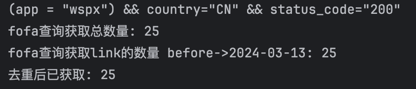
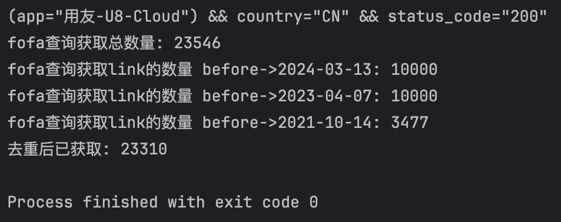
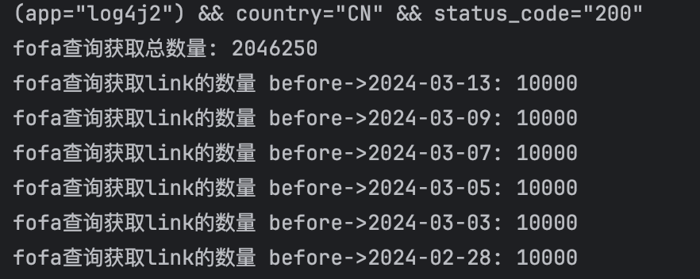

# Fofa-dump
fofa快速获取的小工具  
## 简介
因为fofa禁用了before+after的联合查询，但是仍然允许单个参数查询，所以该工具是只针对before这一条过滤的高效工具  
需要高级会员, 某宝10块一个月, 只变动query其他不影响  
## 核心算法
二分法确定下一个before
```python
while left < right:
    mid = (left + right) // 2

    query = '{query} && before="{before}"'.format(query=self.query, before=decrease(timestamp_before, mid))
    result = self.my_fofa(query, size=1)
    if result is not None:
        next_size = int(result['size'])
        diff = last_size - next_size
        # print(diff)
        if diff == target:
            right = mid
        elif diff < target:
            left = mid + 1
        elif diff > target:
            right = mid
```
优化：该程序二分法的初始跨度为365天, 程序会根据每次最终确定的天数动态调整二分法的边界，固定为两次查询before时间差距的二倍
# 测试
wspx少量  
<div  align="center">    
 
</div>
用友(中量)  
<div  align="center">    
 
</div>
log4j2(大量)  
<div  align="center">    
 
</div>
